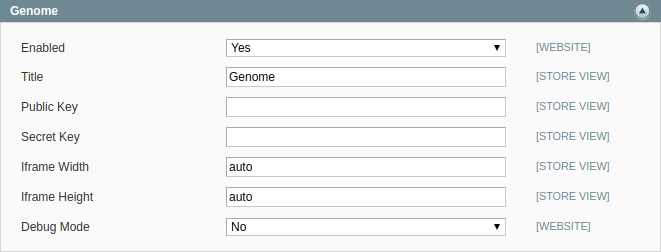

Module for Magento 1.9
=====
#EN

Installation
----
Copy all files to `{site root directory}/`

>1. Login to admin interface

>2. Navigate to menu "System" -> "Configuration" 

>3. Open tab "Payment methods"

>4. Choose Genome

>5. Enable module

#RU

Установка
----
Содержимое скопировать в папку `{корень сайта}/`

>1. Зайти в панель администратора

>2. Перейти в раздел "Система" -> "Конфигурация" ( "System" -> "Configuration" )

>3. Открыть вкладку "Платежные методы" ( "Payment methods" )

>4. Выбрать Genome

>5. Включить модуль и ввести все настройки 

Callback URL : `https://yoursite/genome/payment/callback`

Decline URL : `https://yoursite/genome/payment/decline`

Success URL : `https://yoursite/genome/payment/success`

-----

Example of "Genome" settings:

